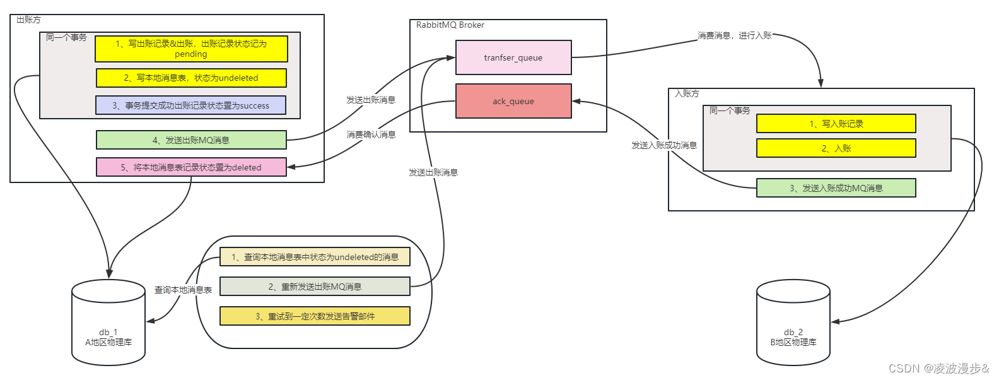

# 本地消息表保证最终一致性

```sql
CREATE TABLE `message_record`
(
    `id`             bigint(20) NOT NULL AUTO_INCREMENT COMMENT '主键ID',
    `business_id`    varchar(64)       DEFAULT NULL COMMENT '业务数据ID',
    `topic`          varchar(64)       NOT NULL COMMENT 'topic',
    `business_type`  varchar(64)       DEFAULT NULL COMMENT '业务类型：具体业务',
    `retries_number` int               DEFAULT 0 COMMENT '重试次数',
    `msg_status`     int               DEFAULT 0 COMMENT '结果 1 成功  0 失败',
    `msg_text`       text     NOT NULL COMMENT '消息内容',
    `create_time`    datetime NOT NULL DEFAULT CURRENT_TIMESTAMP COMMENT '创建时间',
    PRIMARY KEY (`id`)
) ENGINE=InnoDB AUTO_INCREMENT=2 DEFAULT CHARSET=utf8 COMMENT='本地消息记录表';

```

```sql
create table oms_order
(
    id                      bigint       not null auto_increment comment '订单id',
    member_id               bigint       not null comment '会员id',
    total_amount            decimal(10, 2) comment '订单总金额',
    receiver_name           varchar(100) not null comment '收货人姓名',
    receiver_phone          varchar(32)  not null comment '收货人电话',
    receiver_detail_address varchar(200) comment '详细地址',
    primary key (id)
);
```


订单支付完成->扣减库存
状态：
1.生产者已投递
2.消费系统已消费
3.生产者发布失败
4.通知队列发送成功
5.通知队列发送失败